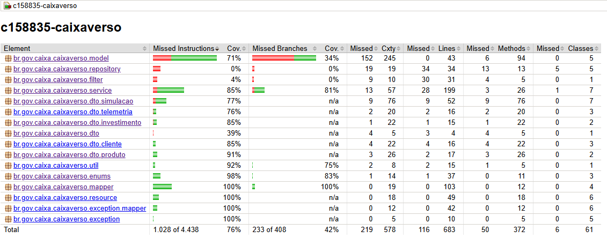

# c158835-caixaverso


## Rodando a aplicação:

Para rodar a aplicação abra o terminal na raiz do projeto e execute o comando:

```shell script
  docker compose up --build
```

Após a aplicação finalizar a inicialização dos containers, aguarde 15-20 segundos
para dar tempo de iniciar tudo após os containers inicializarem.

## Documentação

Pode acessar o swagger pelo navegador acessando:

<http://localhost:8080/q/swagger-ui>

## Autenticação

Todas as apis estão com autenticação OAuth2 habilitada, portanto
é necessário criar um usuário acessando o endpoint (está listado no swagger com o corpo especificado):

POST http://localhost:8080/auth/registro

Corpo:
```script
{
  "nome": "Joao",
  "sobrenome": "Silva",
  "email": "joao.silva@caixa.gov.br",
  "senha": "abc123"
}
```
 - Após criação do usuário é necessário se autenticar, dentro do próprio swagger no
botão "Authorize" localizado no canto superior direito, já na primeira opção:
"SecurityScheme (OAuth2, authorization_code)" basta digitar no campo 
client_id o valor "quarkus-app" (ignore os demais campos e clique em Authorize logo abaixo).

- Será redirecionado para uma tela do Keycloak, após isso basta digitar o email cadastrado
como username e a senha que será redirecionado de volta ao swagger já autenticado.

- O Token tem uma duração de 5 minutos, se expirar e começar a receber 401 
basta se autenticar novamente.

- Caso prefira testar as APIs pelo Postman, após realizar o registro, chame o endpoint:
POST <http://localhost:8180/realms/quarkus-app/protocol/openid-connect/token>, com
o corpo em formato x-www-form-urlencoded e os campos especificados no cURL abaixo:
```script
curl --location 'http://localhost:8180/realms/quarkus-app/protocol/openid-connect/token' \
--header 'Content-Type: application/x-www-form-urlencoded' \
--data-urlencode 'grant_type=password' \
--data-urlencode 'client_id=quarkus-app' \
--data-urlencode 'username=<SEU_EMAIL_AQUI>' \
--data-urlencode 'password=<SUA_SENHA_AQUI>'
```
 - Esse endpoint retornará o access_token que pode ser passado no header de 
Authorization (Bearer) de qualquer outro endpoint da aplicação.

## Testes

Último report de cobertura de testes utilizando jacoco indicou cobertura de 76%:


## TODO

 - Testes de integração (Em progresso)
 - Melhorar documentacao
